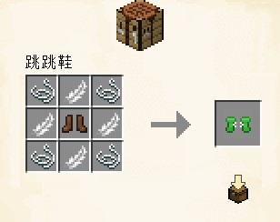

# 跳跳鞋

“爸爸为什么那些人可以轻松跳过那些阶级?” “因为他们有跳跳鞋”

长大后的我也有了跳跳鞋，但还是无法跳过那些阶级

正当我思考时，靴子上的羽毛怎么不见了? 我才明白原来是他们洗脑牟利的谎言

## 特性

穿上时处于空中可以双击空格触发一次二段跳并同时向前冲刺一段距离

触发后落地前无法再次触发直到落地重置即可再次触发

 外观参考了 马里奥3 里的鞋子

> ## 属性
>
> 盔甲韧性 1
>
> 护甲值 2
>
> 耐久 64

由皮革靴子改造而来，超强的实用性让这双鞋子发挥了强大的作用

他的防御方面比较鸡肋，但是他的实用性弥补了这一缺点

## 制作配方

### 材料总需

* 羽毛 x4
* 线 x4
* 皮革靴子 x1

> 编辑: TATyKeFei
>
> 最后更新时间: 2025.1.7