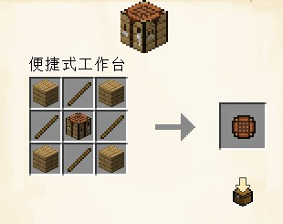

# 便捷式工作台

只有工作台 3x3 的格子才能合成一些东西，但每次都得把工作台放出来非常不便

欸🤓☝！我把工作台的顶部拿出来不就得了！于是便捷式工作台就这么诞生了

## 制作配方

使用工作台合成

### 材料总需

* 橡木木板 x4
* 木棍 x4
* 工作台 x1

## 能力

手持便捷式工作台右键可以直接打开工作台界面，而无需点击工作台

> 编辑 TATyKeFei
>
> 最近更新 2025.01.24