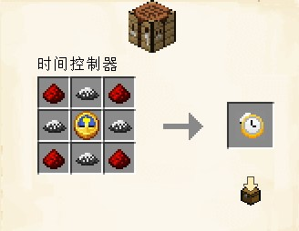
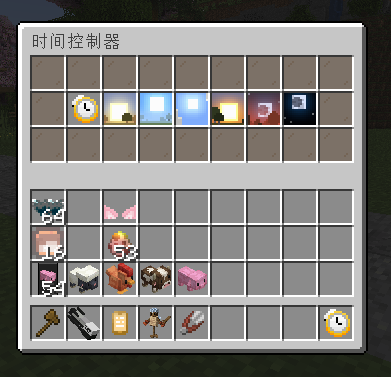

# 时间控制器

时间是物质不停变化，是人类所创造不存在的概念

但有人用魔术粉与一块钟一起合成后，发现居然可以控制自己的时间！？？

但其实是心理作用啦~（只要我觉得现在是白天就是白天）但尽管如此还是有人觉得真的能控制时间

## 合成配方

使用工作台合成

### 材料总需

* 魔术粉 x4
* 红石 x4
* 时钟 x1

## 能力

更改玩家客户端本地游戏时间，固定为某一时间（仅自己可见）

想恢复可以潜行状态下右键时间控制器恢复

很适合晚上的时候太暗看不清，用这个可以把自己的本地时间调为白天

也适合拿来拍照，不用担心错过太阳位置要硬登24分钟

> [!ATTENTION]
> 注意! 传送其他世界后失效