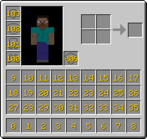

# 镘刀

现实生活中常见于建筑工人用来为盖房子的砖涂抹水泥的工具

## 制作配方

### 材料总需

* 铁锭 x1
* 木棍 x1

## 使用方法

将方块放在快捷栏时，使用镘刀右键地面可随机放置快捷栏里的方块

> [!TIP]
> 快捷栏是指玩家键盘上可用数字键或鼠标滚轮快捷切换物品的物品槽位
>
> 如下图中 0~8 的位置
>
> 
>
> 此图片素材来源于 [Minecraft Wiki](https://zh.minecraft.wiki/w/%E7%89%A9%E5%93%81%E6%A0%8F?variant=zh-cn)

常见用法有铺不规则路、不规则墙面、遗迹建筑等等

> 编辑 TATyKeFei
>
> 最近更新 2025/1/18